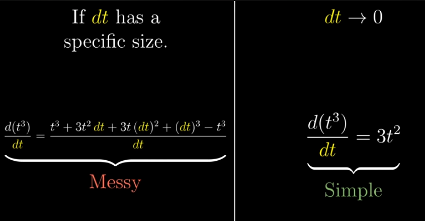
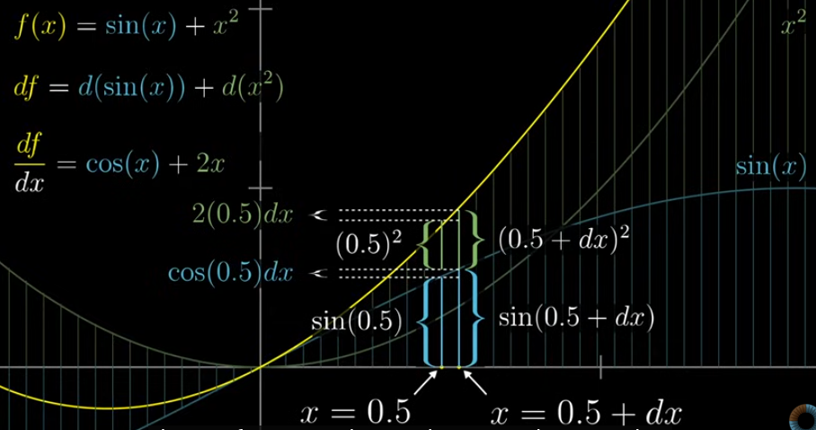
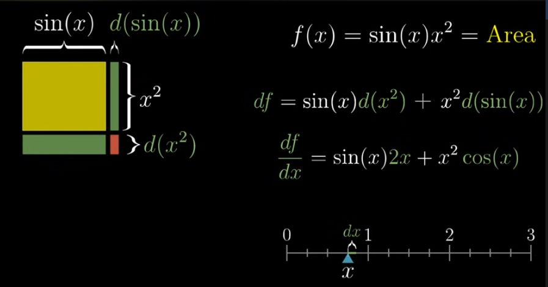
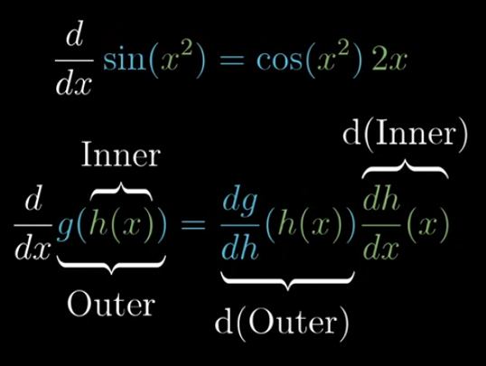

# Table of Contents
- [Calculus](#calculus)
  - [Derivative](#derivative)
  - [Sum Rule](#sum-rule)
  - [Product Rule](#product-rule)
  - [Chain Rule](#chain-rule)

# Calculus

- Calculus deals with understanding change(derivatives) and accumulation(integrals)
- Finding area of circle
    - Area of circle is πr^2
    - Circle → concentric rings
    - Each ring has radius, thickness (dr) and circumference
    - Approximating each ring as a rectangle with height 2πr and small thickness dr
    - Total area = sum of all areas of rectangles
    - Collectively it forms a right angled triangle in a graph, area of triangle = 1/2 bh
    - base is r and height is 2πr, so area of circle → πr^2
- Summation of infinitely many small parts leads to exact area. This idea of summing of small pieces is called **Integration**
- Small change in input dx and output da, this ratio approximates the function’s value at that point
- Derivative measure how sensitive a function is to changes in input

> Derivative and integrals are inverse processes  
Integral accumulates values, whereas derivative gives the rate of change

## Derivative

- Measures instantaneous rate of change
- Change always happens between two separate points. The derivative measures how the function changes over a very small, non-zero interval - that approaches towards 0
- Its equal to slope of the tangent line to the graph at a single point

When dt is smaller, during computation those terms will get vanished eventually → making computation easier

Functions can be combined together by,

- Addition
- Multiplication
- Composition

## Sum Rule

Derivative of a sum of two functions = Sum of their deivatives

$$
d( g(x) + h(x))/dx = d(g(x))/dx + d(h(x))/dx
$$

Example: f(x) = sin(x) + x^2

Here, d(f) = f(x+dx) - d(x)

Results in, df = d(sin(x)) + d(x^2)

## Product Rule

Derivative of product of two functions

$$
d( g(x).h(x))/dx = g(x). [d(h(x))/dx] + h(x).[d(g(x))/dx]
$$

Example: f(sin(x)x^2)

## Chain Rule

- One function inside the other function → Function Composition
- Derivative of composition function is taken by,

$$
d (g (h(x))/dx = (dg/dh).(dh/dx) \\
d (g (h(x))/dx = dg/dx
$$

Small change in g due to change in h and multiply it with change in h due to change in x  
→We are chaining the causes, thus it is called as Chain Rule
