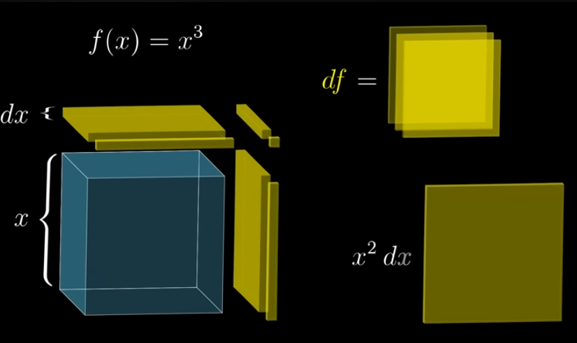
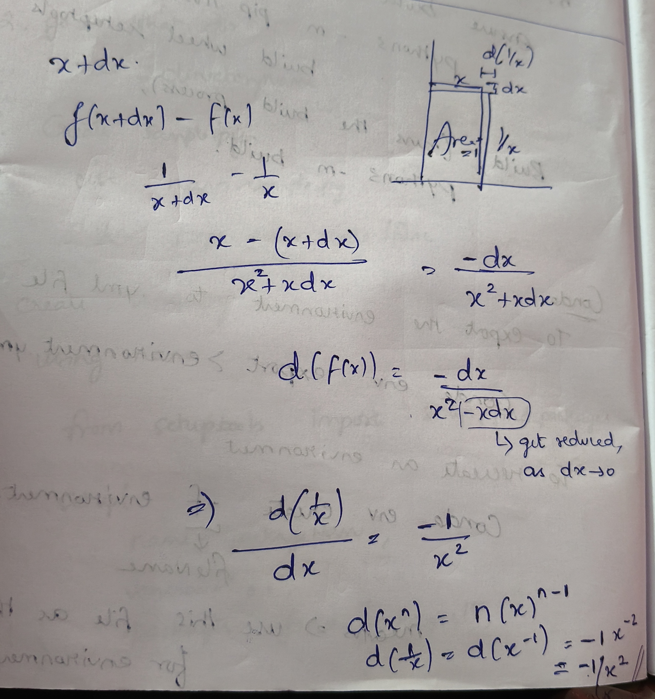
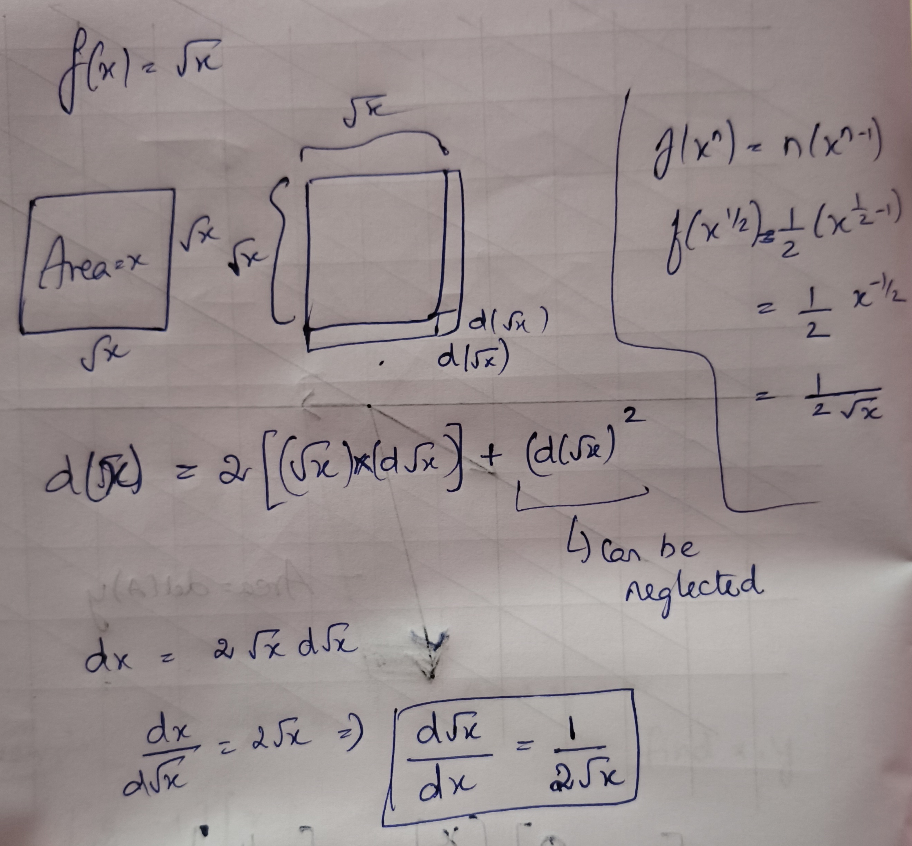
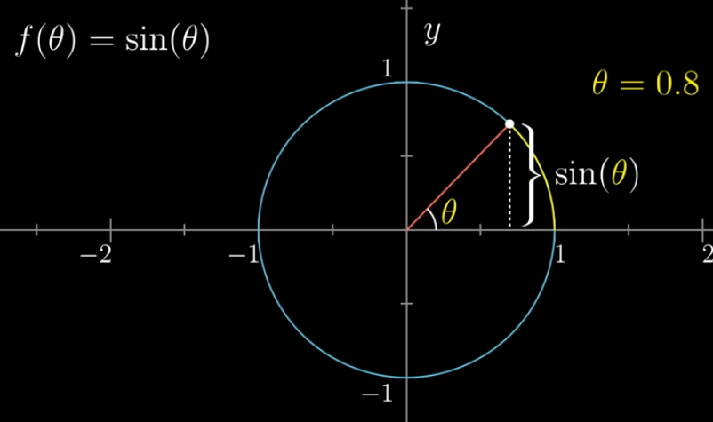
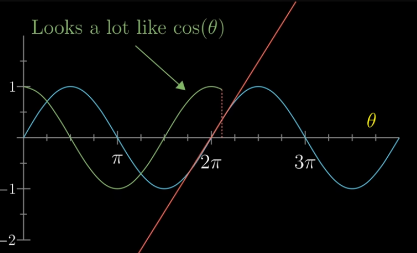
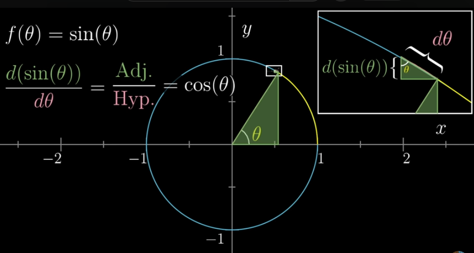
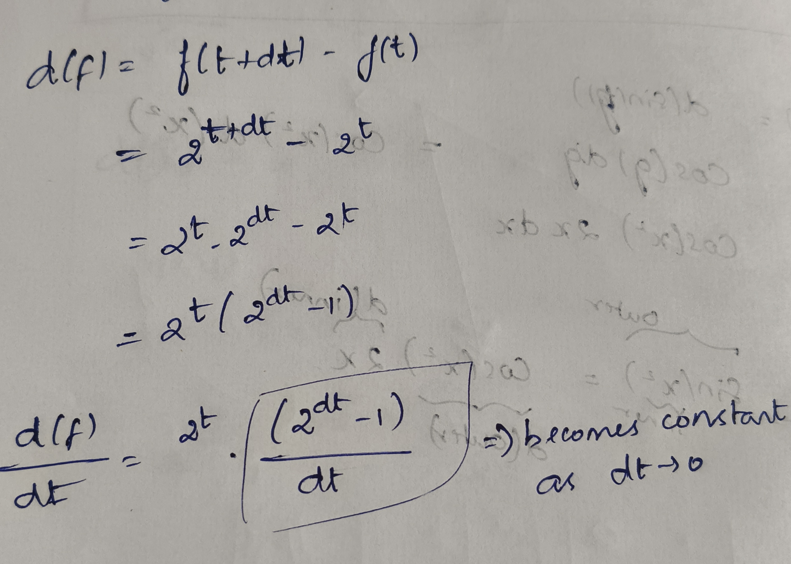

# Table of Contents
- [Derivative formulas](#derivative-formulas)
  - [Power Rule examples](#power-rule-examples)
  - [General Power Rule](#general-power-rule)
  - [Derivative of 1/x](#derivative-of-1x)
  - [Derivative of sqrt(x)](#derivative-of-sqrtx)
  - [Derivative of sin(theta)](#derivative-of-sintheta)
  - [Derivative of Exponential Functions](#derivative-of-exponential-functions)

---

### Derivative formulas:

- for function f(x) = x²  
It gives an upward parabola  

Here dx² is very tiny amount → negligible

- For f(x) = x³  

- When x is changed a little bit, the volume also get changed
- Here the small cubes and side rectangles can be neglected as they are very small in actual computation
- Only 3 squared volumes are considere
- Thus it becomes 3 x² dx (l*b*h)
- df/dx → divided by dx, all the dx terms will get discarded here

<aside>
💡

In general way,  
**d (xⁿ) / dx = nxⁿ⁻¹**

This is known as “**Power Rule**”

</aside>

Small change dx added to x, f(x+dx) = (x+dx)ⁿ

- d(f(x)) = f(x+dx) - f(x)  
And this will get divided by dx on both sides  
Thus, xⁿ and dx terms get reduced

---

- f(x) = 1/x  
    - Here,
        f(1) = 1  
        f(2) = 0.5  
        f(3) = 0.33  
    - The area is 1  

        Can be found in 2 ways,

(or)

---

- f(x) = sqrt(x)

---

- f(theta) = sin(theta)

Here d(sin(theta)) / d(theta) = slope of this graph

Consider a small change in theta, this increases the sin(theta)

---

# Derivative of exponent

- this constant will get added on for any x^t
- The constant is directly proportional to x
- This constant will be 1 when x=e (Euler number)

**Derivative of e^x = e^x**

**Derivative of e^(cx) = c e^(cx), where c is constant (by chain rule)**

$$
x = e^{(\ln(x))}
$$

From this,

$$
\frac{d}{dt}\left(2^t\right) = \frac{d}{dt}\left(e^{(\ln 2)t}\right)
$$

We know that,

$$
\frac{d}{dt}\left(e^{ct}\right) = c e^{ct}
$$

By applying,

$$
\frac{d}{dt}\left(e^{(\ln 2)t}\right)
= (\ln 2)\, e^{(\ln 2)t}
\\
(\ln 2)\, e^{(\ln 2)t} = (\ln 2)\, 2^t
\\
\frac{d}{dt}\left(2^t\right) = (\ln 2)\, 2^t
$$
