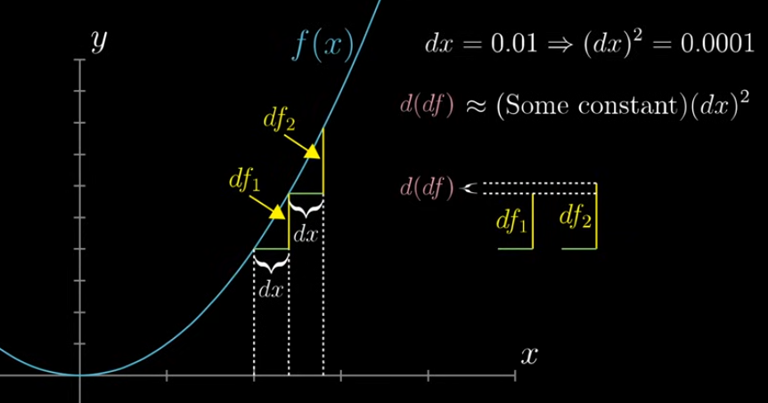
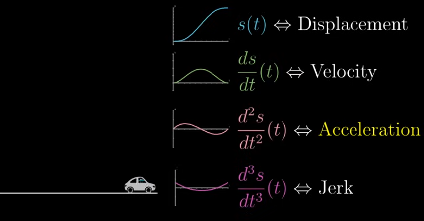

# Table of Contents
- [Higher Order Derivative](#higher-order-derivative)
- [Transformation View](#transformation-view)

---

# Higher Order Derivative

- Derivative of a derivative  
- Second order derivative → Derivative of a slope, tells how the slope is changing

First step causes some change → left it be df1

Second step causes some change → left it be df2

The difference between these 2 changes, the change in how function changes → d(df)

**Example:**

Acceleration → describes how the velocity changes

---

**Derivative → Slope of the graph**

**Integral → Area of the graph**

---

# Transformation View

- Many complex functions are hard to analyse by graphs  
- Derivative of the function is the new function which for every input x returns that slope  
- Derivative → how sensitive the function’s output is to small changes in the input  
- This can be viewed as mapping of input space on number line to their corresponding outputs on a different number line  
    - In this context, Derivative gives how much the input space gets stretched or squished in various regions  
    - Derivative is negative at a point → it stretches and flips the view
- **Stability of a fixed point** is determined by whether or not the magnitude of its derivative is bigger or smaller than 1  
    - When derivative is greater than 1, it stretches out → Unstable fixed point  
    - When derivative is lesser than 1, it squishes in → Stable fixed point
