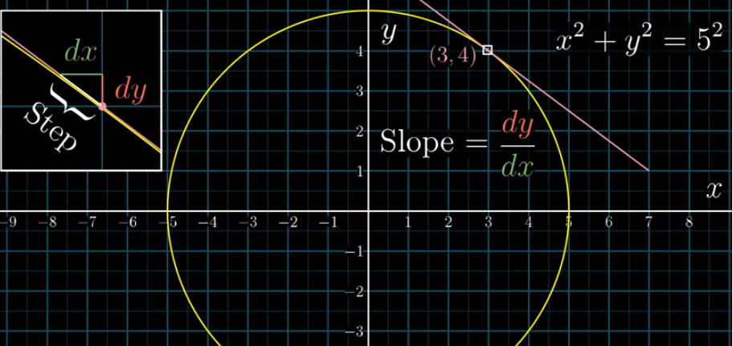
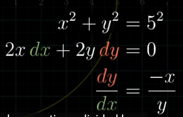
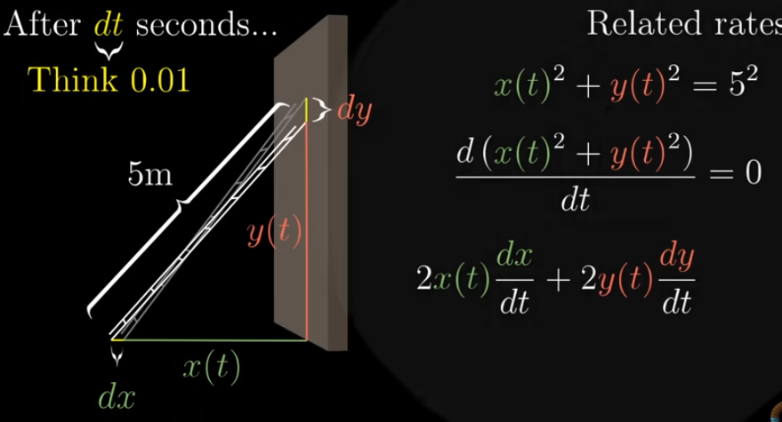

# Implicit Differentiation

- Implicit differentiation is a way to find dy/dx when y is not explicitly solved in terms of x
- In general, we differentiate both sides with respect to x, and multiply by dy/dx whenever y is differentiated
- Treat y as a function of x

## Examples

### Slope of a tangent line to the circle

- Circle equation: x^2 + y^2 = radius^2 (constant)
- Slope of a tangent line → how steeps the tangent is
    
    
    
- Here the curve is not a function, instead an equation
- So, we take derivative of both sides, and rearrange them as needed
    
    
    

### Related Rates problem

- Probelms: A ladder is positioned against a wall, and slipping away. What’s the rate at which the bottom of the ladder is moving away from the wall, initially.
- Here, the bottom of ladder moves away based on the distance between floor to the tip of ladder laid on the wall
- Let bottom distance (wall and bottom of ladder) be x(t) and top of ladder on wall and floor be y(t)
- Its clear that we need to find d(x) / d(t), and x depends on y(t) → can use Chain Rule
- Implicit differentiation
    
    
    
    Differentiate wrt change in time(dt)
    When dy/dt is known, dx/dt can be found
