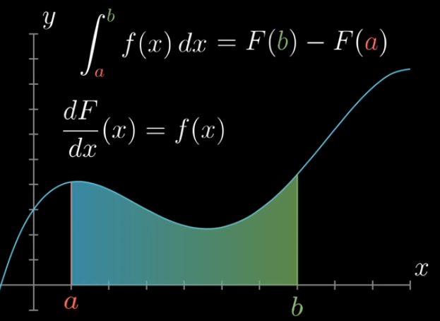
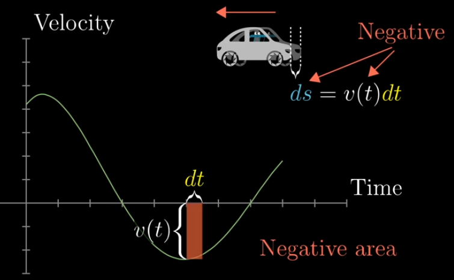
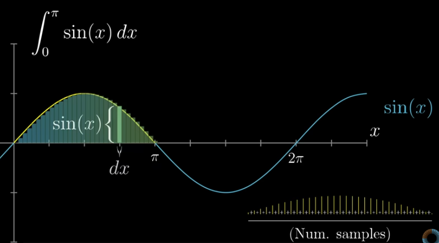
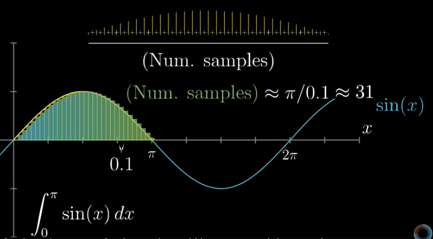
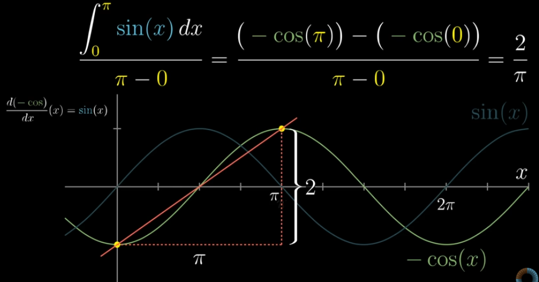

# Integration

- Integration is the process of **summing up a large number of small contributions** to find a total quantity
    
    $$
    ∫f(x)dx=F(x)+C
    $$
    
    where F(x) is anti-derivative of f(x)
    
- Many problems can broken down and approximated as the sum of a large number of small things

Here, dF(x) /dx → anti-derivative of f(x)

Actually there are infinite anti-derivative of the given function, since derivative of the constant is 0. So in anti-derivative, we will always have a c (constant) term added to it

**Example**

Here, velocity v(t) varies over time

- If velocity were constant: s=v.t
- But it varies. So splitting the areas into different small rectangles (at small intervals Δt) and adding them up
- If the area is negative → car moves backward, then v(t)dt will become negative

> **Integrals always measure the signed area between the graph and the horizontal axis**
> 

---

## Average of a Continuous function

- When we want to add together infinitely many values associated with a continuum → use integral
    - Approximate the situation as a finite sum
- **Slope** is just the steepness or rate of change of a function at a point
- For a discrete set of samples
    
    $$
    Average\,height=\frac {Sum\,of\,heights}{Number\,of\, samples}
    $$
    
- **For example (continuous function)**
    - To find average height of the given function, broke down that into small intervals dx → 0.
      Sum of sin(x) over pi, and divided by number of samples
    - This can be expressed in integral as,
    
    
    
    Here, integral of sin(x) dx is summation of small triangles (Area)
    
    
    
    Number of samples = total length / split interval (dx)
    
    After substituting and rearranging the equation it is same as Integral of the function divided by its width
    
- For a continuous function f(x) over [a, b], we take the limit as the intervals become infinitesimally small
    
    $$
    Average\,value\,of\,f(x)\,on \,[a, b]= \frac 1 {b−a}∫_a^bf(x)dx
    $$
    
    - Think of summing infinitely many tiny rectangles (f(x) dx) and dividing by the total width (b−a) → the average height of the function
    
    
    
    LHS → {F(upper bound) - F(lower bound)} / (upper bound - lower bound)
    
- So the average height under the curve f(x) is the average slope of its anti-derivative F(x) over the interval
    
    (i.e) Slope at pi - Slope at 0 of F(x)
    
- The function f(x) is exactly the derivative or slope function of F(x). The slope of F(x) at any point *x* represents how quickly this accumulated area is increasing at x

Avg height = signed area of graph / width
