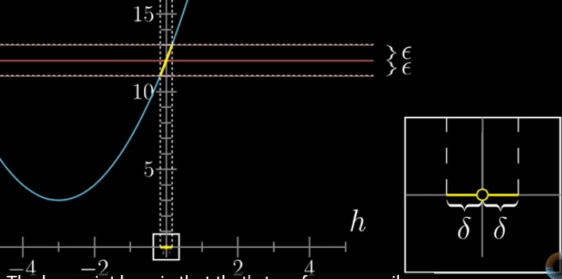
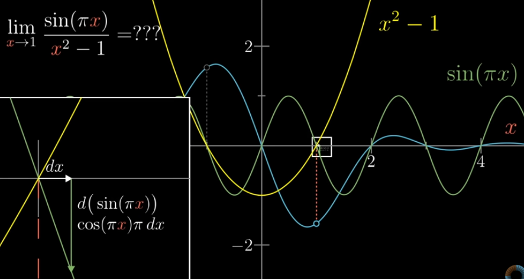

# Table of Contents
- [Definition of Derivative](#definition-of-derivative)
- [Limit](#limit)
  - [When limit exists](#when-limit-exists)
  - [When limit does not exist](#when-limit-does-not-exist)
  - [Important notes](#important-notes)
- [L’Hopital’s Rule - Limit computation](#lhopitals-rule---limit-computation)
  - [Example](#example)

---

# Definition of Derivative

$$
\frac{df(x)}{dt} = \frac{f(x+dx)-f(x)}{dx}, dx->0 \\[3mm] 

\frac{df(x)}{dt} =  \lim_{h \to 0}\frac{f(x+h)-f(x)}{h}
$$

where change in x (dx) is represented as Δx or h

# Limit

For a given range of inputs within some distance of 0, excluding the forbidden point 0 itself, the range of output values closes in more and more closely around some point.  
From +ve towards 0 or from -ve towards 0, the output values tends to be closer to certain value.  
**Then limit exists for such functions.**

If the function is not defined at 0 and also jumps that part → from -ve towards 0 and from +ve towards 0 are not same → **then, limit doesn’t exists**

---

## When limit exists

For Range of inputs around the limiting point, some distance delta around 0, so that any input within delta of 0 corresponds to an output within a distance epsilon

No matter how small the epsilon is, we can always find the corresponding delta

---

## When limit does not exist

No matter how small the epsilon is, the corresponding output range will always be big.  
There is no limiting output where everything is within a distance epsilon of that output

---

<aside>
💡

- **Limits being used to formally define the derivative**  
- **Epsilons and deltas being used to define the limit**  
- Limits are used to define the derivatives as well as derivatives can help to evaluate the limits  

</aside>

---

# L’Hopital’s Rule - Limit computation

- When direct substitution in a limit(x→a) gives **0/0** or **∞/∞**, L’Hopital’s Rule can be used  
    - But actually, it exists but becomes *indeterminate*  
    - So that we can approximate the value by taking derivatives of 2 functions separately  

- If both the numerator and denominator approach 0 (or both approach ∞) as x→a, and if their derivatives exist and the new limit exists

$$
\lim_{x \to a}  \frac {f(x)} {g(x)} = \frac {\frac {df(a)}{dx}dx} {\frac {dg(a)}{dx}dx}
\\[5mm]
(i.e)
\\[5mm]
\lim_{x \to a}  \frac {f(x)} {g(x)} =  \frac {df(a)} {dg(a)}
$$

- Derivatives are taken separately  
    - If derivative exists then limit exists, else not  
- Apply the L’Hopital’s Rule repeatedly until the limit exists

---

## Example

$$
\lim_{x \to 1} \frac{\sin(\pi x)}{x^2 - 1}
$$

Here, when x=1, the function tends to ∞ as sin(π)=0 and 1²−1 = 0

To find whether limit

Similarly, for x²−1,  
d(x²−1) = 2x dx

---

Applying L’Hopital:

$$
\lim_{x \to 1} \frac{\sin(\pi x)}{x^2 - 1}
\\[5mm]
= \lim_{x \to 1} \frac{\pi \cos(\pi x)}{2x}
\\[5mm]
= \frac{\pi \cos(\pi)}{2 \cdot 1}
= \frac{\pi(-1)}{2}
= -\frac{\pi}{2}
$$

Here, take derivative for both sin(πx) and x²−1 individually, and then apply limit
