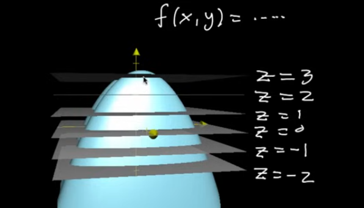
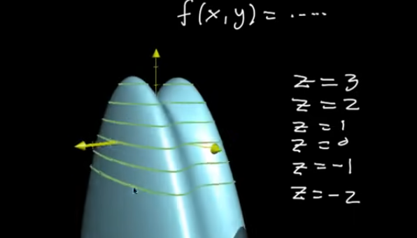
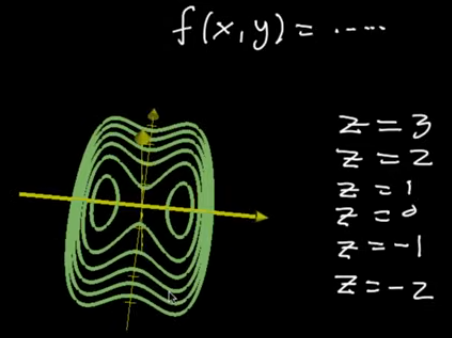
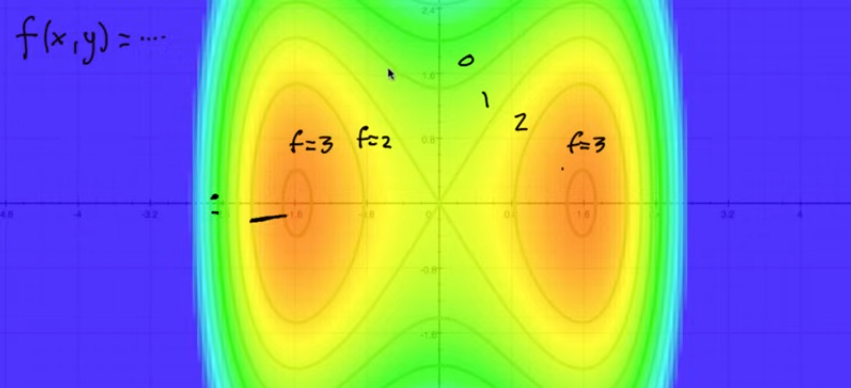
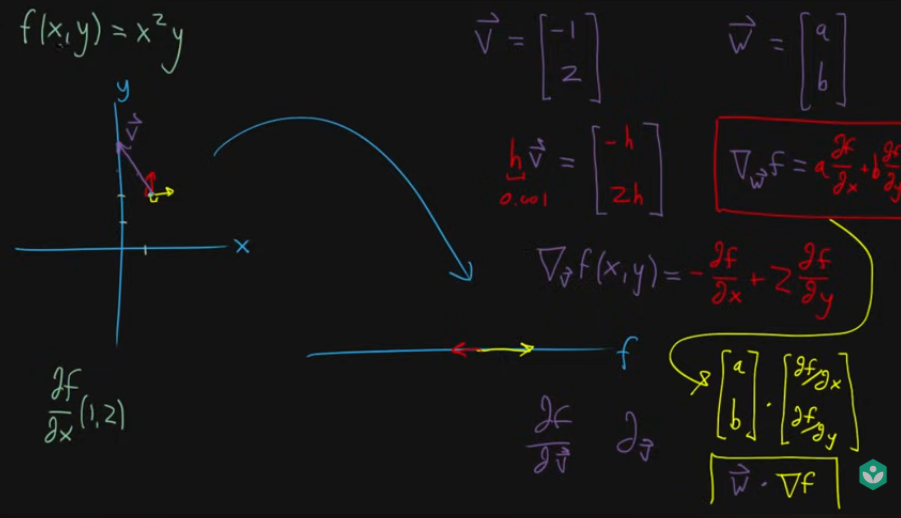

# Multivariable Calculus

## Table of Contents
- [Multivariable function](#multivariable-function)
- [Contour plots](#contour-plots)
- [Gradient](#gradient)
- [Directional Derivative](#directional-derivative)

---

## Multivariable function

- Multiple inputs and outputs
    
    $$
    f(x, y) = x^2+y
    $$
    
    Output depends on x and y. The output can also be a vector
    

## Contour plots

- 3 Dimensional graph → Representing a function that has 2D input and 1 dimensional output
- Contour plots → Way of representing the 3D graph in 2D  
- Slice the 3D graph into multiple planes where all are parallel to xy plane
    
    
    
- Drawing lines where the slices cut into the graph is called contour lines
    
    
    
- Squish the lines on the xy plane
    
    
    
    - Each of these lines represent the constant output of the function  
    - Still representing the 2D input, 1D output but on a input space itself  
    - Short distance between the contour lines → steep → needs smaller steps  
    - Large distance between the contour lines → shallow → needs larger steps

## Gradient

- A vector of partial derivatives of the function  
- Gradient points are in the direction of steepest ascent, its magnitude gives how steep the ascent is  
- A vector, whose components are scalars, each representing the rate of change of the function along the standard unit vectors of whichever basis being used  
- It only tells us how the function is changing with respect to the axes of our co-ordinate system  

## Directional Derivative

- Gradient only gives the rate of change along coordinate directions. Whereas directional derivative gives the rate of change along **any arbitrary direction**  
- Let w vector be the vector representing that direction  
- Then directional derivative is,
    
    
    
    Here, we have 2D input mapping to 1D output space  
    Here, w vector is direction we are moving along with (in a tiny nudge)
    
    $$
    D_w f = ∇f \cdot w
    $$
    
    where, w is a unit vector showing the direction we want to move.  
    Output is a scalar → tells how fast the function changes along direction w.
    
- In short, directional derivative is a scalar value which represents the rate of change of the function along a direction (which is typically not in the direction of one of the standard basis vectors)
    
    $$
    Partial\,Derivation\, of \,vector\, function,\\[2mm] 
    \frac{\partial f}{\partial x}({\vec{a}}) = 
    \lim_{h \to 0} \frac{f({\vec{a}} + h \hat{i}) - f({\vec{a}})}{h} 
    \\[7mm]
    
    Directional\,Derivation\, of \,vector\, function,\\[2mm]
    \triangle_{\vec{w}} f({\vec{a}}) = 
    \lim_{h \to 0} \frac{f({\vec{a}} + h \vec{w}) - f({\vec{a}})}{h} 
    $$
