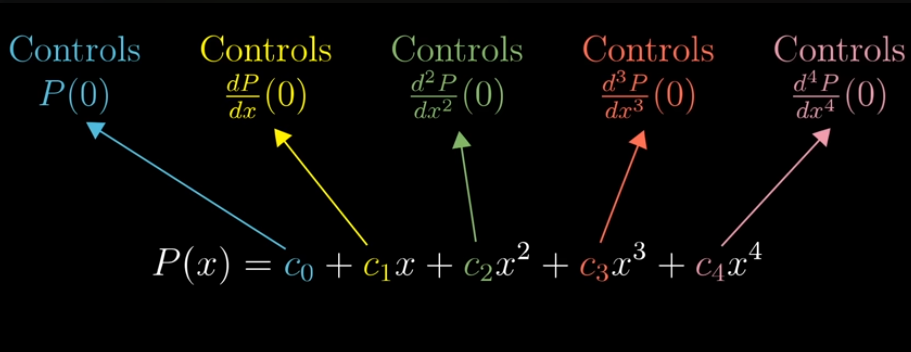
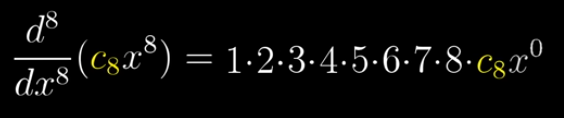
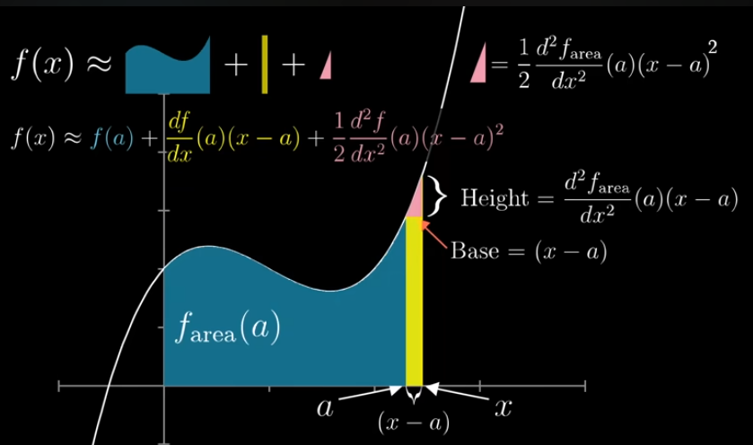
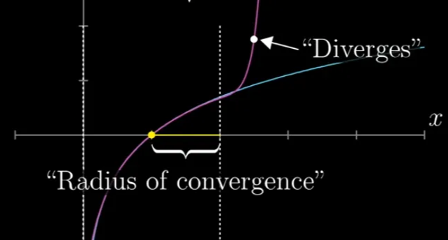

# Table of Contents
- [Taylor Series](#taylor-series)
  - [Taylor Polynomial](#taylor-polynomial)
  - [Taylor Series Expansion](#taylor-series-expansion)

---

# Taylor Series

- Taking Non-polynomial functions, then finding polynomials that approximate them near some input  
- **Example:** f(x) = cos(x)

- Here, the 3 constant values can be chosen freely (approximating near 0)  
  P(x) = c1 + c2x + c3 x^2
- cos(0) = 1, We will get P(0) = 1
- Fixing the slope of the function at 0. Slope is -sin(x)
    - f’(cos(x)) = -sin(x)
    - WKT, at 0, -sin(0) = 0
    - c2 = 0
- Finding second derivative, change of slope
    - Having negative second derivative as curves downward above x  
    - Second derivative is -cos(x). At 0, -cos(0) = -1  
    - Thus c2 is -1/2

As the number of polynomial terms increases, gives more control over the function

**Each derivative of a polynomial at x=0, is controlled by one and only one of the coefficients**

> If we are approximating near an input other than 0, in order to get the same effect, the polynomial needs to written as powers of (x-input)

- When we take n successive derivatives of the function x to the n,

So, c8 can be set as **desired derivative value / 8!**

$$
c_8 = \frac {Desired\,Derivative\, value} {8!}
$$

---

## Taylor Polynomial

$$
P(x) = f(0) + \frac {df}{dx} (0) \frac {x^1}{1!} + \frac {d^2f}{dx^2} (0) \frac {x^2}{2!} + \frac {d^3f}{dx^3} (0) \frac {x^3}{3!} + ....
$$

If approximating near some input ‘a’ other than 0, then

$$
P(x) = f(a) + \frac {df}{dx} (a) \frac {(x-a)^1}{1!} + \frac {d^2f}{dx^2} (a) \frac {(x-a)^2}{2!} + \frac {d^3f}{dx^3} (a) \frac {(x-a)^3}{3!} + ....
$$

**Why it is (x-a) ?**

- If the dx not tends to 0, then the base will be (x-a)
- Height is slope(a).(x-a) → This measures how taller the line (approximate curve) has gotten after moving a distance (x−a)
- **Rectangle:** “What if the hill stays at the same slope?” (First derivative) → **change from slope**
- **Triangle:** “How much does the slope change as I walk?” (Second derivative) → **change from curvature**

---

## Taylor Series Expansion

- Adding all infinitely many terms gives Taylor Series, The series will converges to some value
    - This series, infinite sum will equals the value it’s converging to
    - For example, Taylor series of e^x converges to the value of e^x
- Series that doesn’t approach anything even after adding more terms → Series Diverges
    - For example, ln(x)
- The maximum distance between the input we are approximating near and points where the outputs of these polynomials actually do converge is called the radius of convergence for the Taylor series

- Converge tests (whether the series converges or not)
- Lagrange error bounds (placing bounds on the error these approximations)

> 💡  
> **Taylor Series**  
> Translate derivative information at a single point to approximation information around that point
