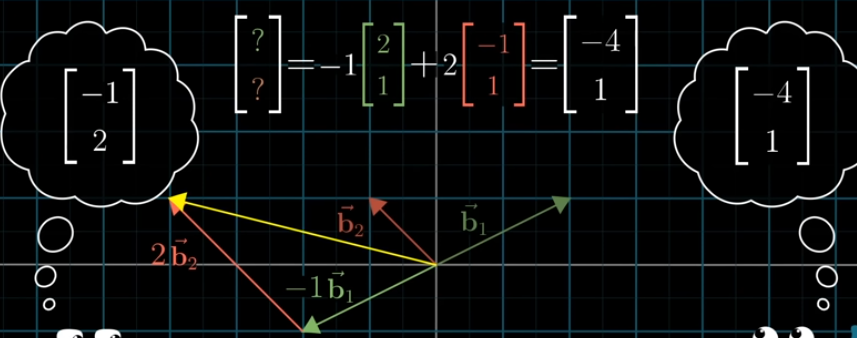
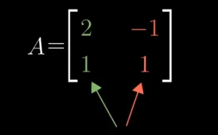
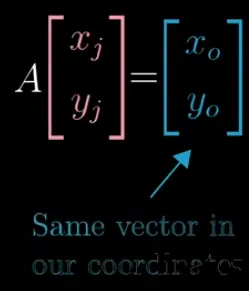
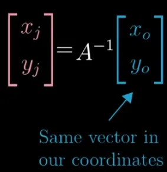

# Basis Vectors

---

# Basis Vectors

- Any way to translate between vectors and sets of numbers is called a coordinate system
- **i hat and j hat are basis vectors of the co-ordinate system**
- Basis and spacing can be changed, origin will remain the same
    
    
    

Here b1 and b2 vector are the different basis vectors

$$
A = \begin{pmatrix} b_{1} \\ b_{2} \end{pmatrix}
$$

- To represent the given vector in standard co-ordinate system, we need to transform it
- The process done here is matrix vector multiplication
- The resultant vector will have the same basis vector as the transformation matrix
- To convert the vector in standard co-ordinate system to the modified co-ordinate system, we need to transform the vector with inverse of the transformation matrix

**Convert a vector v from modified to standard co-ordinate system,**

$$
u = Av
$$

**Convert a vector u from standard to modified co-ordinate system,**

$$
v = A^{-1}u
$$

### For example:

Modified basis vector, written in standard co-ordinate system

Vector in modified co-ordinate system is represented in standard co-ordinate system by transforming it by the matrix A

Vector in standard co-ordinate system is represented in modified co-ordinate system by transforming it by the inverse of matrix A

> If we need to perform a linear transform, ex: 90 deg counter clockwise rotation  
> We follows the basis vectors, where i hat and j hat lands  
>  
> The same transformation in modified co-ordinate system will be different  
> To find the transformed i hat and j hat lands on the modified co-ordinate system  
> → Take any vector in modified co-ordinate system  
> → Translate that vector to standard co-ordinate system  
> → Apply the actual transformation  
> → Translate it back to the modified co-ordinate system  
> (i.e)  
> **A⁻¹ M A (any input vector), where M is the transformation matrix**  
> results in *req transformation version of the input vector in modified co-ordinate system*  
>  
> The resultant matrix can be used to transform the other vectors in the modified co-ordinate system

