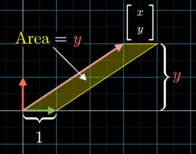
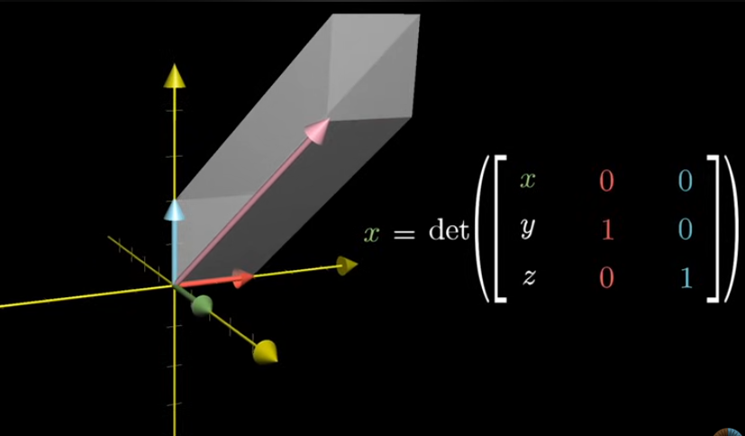

# Cramer’s Rule

---

# Cramer’s Rule

- **Used to solve linear system of equations**
- When det(A) = 0, then no solution or number of solutions
- Dot product of 2 vectors needs not to be same as the dot product of  those vectors after transformation
- **Orthonormal transformations** → preserves the dot product of 2 vectors
    - All the basis vectors are perpendicular to each other and with unit length
    - Rotation matrices, no squishing or stretiching → no morphing

### Intuition

Here area formed by unit vector along x axis and the input vector is 

$$
Area = 1 * y\\ Area = y
$$

Similarly, area formed by unit vector along y axis and the input vector is 

$$
Area = 1 * x\\ Area = x
$$

For 3D, 

This shows that how determinants measure "how much your vector sticks out" along a chosen direction, using the fixed axes

- Determinant → all of the areas get scaled by the same amount
- **All areas get scaled by det(A)**
    
    
    
    Area formed by basis vector along x axis and the input vector is,
    
    Area of parallelogram = det(A)*y
    
    y = Area divided by det(A)
    
    
    

By this way, linear system of equations can be solved. This method is called **Cramer’s Rule**
