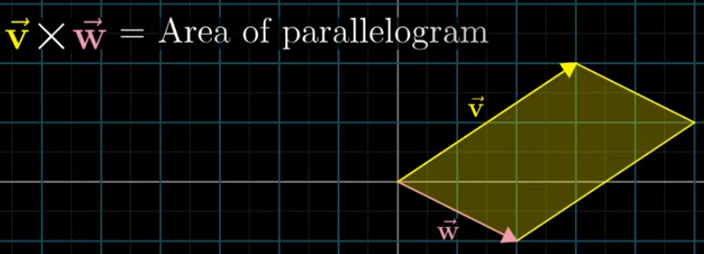

# Cross Products

---

# Cross Products

- Length of Cross Products of 2 vectors is equal to the area of the parallelogram they form
    
    
    
    - If v is on right of w, then the area is positive (orientation remains unchanged)
    - If v is on left of w, then the area is negative (orientation is flipped)
    - Here, **area is negative**
- Order matters in cross products

$$
v⃗×w⃗ = -w⃗×v⃗
$$

- The order of basis vectors is what defines the orientation
    - Since i hat is on the right of j hat, i hat × j hat is +1
- Cross product = determinant of the matrix formed by v and w vector
    - Determinant → measures the factor by which areas are changed
- The area of the parallelogram (cross product) is larger, when the sides are closer to  being perpendicular
- If one of the vector gets scaled up, then the area is also scaled up by the scalar

- Cross product of two 3D vectors is also a 3D vector
    - The length of the resultant vector will be equal to the area of the parallelogram
    - The direction of the resultant vector is perpendicular to the parallelogram
    - Right hand thumb rule is used to find the direction
        - v on index finger
        - w on middle fingle
        - the resultant vector will be on thumb finger direction
        

<aside>
💡

### **det(x, v, w)**

- det(x, v, w) gives the **volume** of the parallelepiped formed by x, v, w.
- **Volume = area of the base (v, w) × height.**
- **Height = how much of x points in the direction perpendicular to v and w.**
    
    That perpendicular direction is the unit vector:
    
    $$
    û= (v × w) / |v × w|
    $$
    

So, **det(x, v, w) = (area of parallelogram of v and w) × (x · û)**

---

### **Using linearity**

The determinant is **linear in x**, which means it can be expressed with some Matrix transformation

Duality of vector → the above can be achieved by taking dot product with some vector p

**det(x, v, w) = p · x**

Compare with the geometric formula:

**p · x = |v × w| × (x · û)**

Since this must hold for **all x**, the vector p must be:

**p = |v × w| × û = v × w**

---

### To conclude,

$$
det(x, v, w) = (v × w) · x
$$

</aside>
