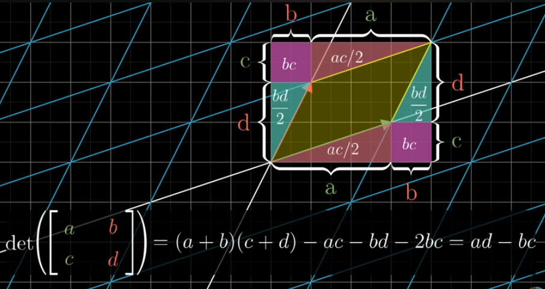
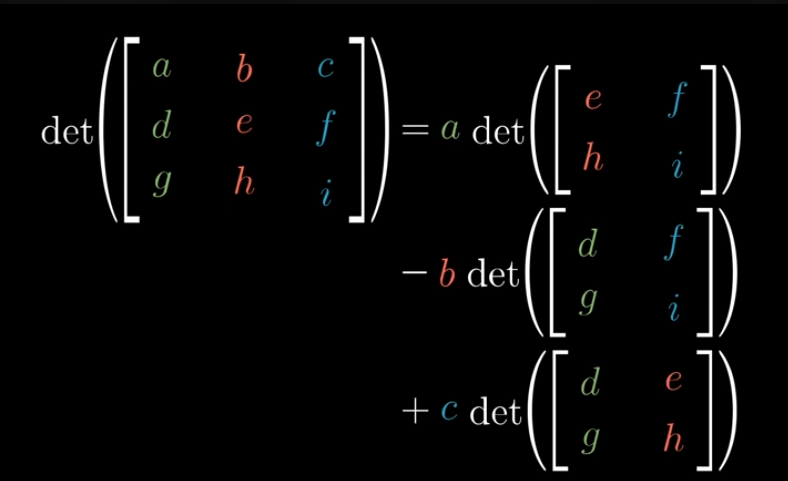

# Determinant

## Table of Contents
- [Determinant](#determinant)
  - [In 2D transformations](#in-2d-transformations)
  - [In 3D transformations](#in-3d-transformations)

# Determinant

- **Determinant → Scaling Factor**

### In 2D transformations

- ***The factor by which a linear transformation changes any area, is called determinant of the transformation***
- Whatever happens to one square grid in a space, has to happen to any other square in a grid, no matter the size
- Example:
    - Determinant = 3, means the transformation increases the area of the region by a factor of 3
    - Determinant = 0.5, means it squishes down the area by 1/2
    - Determinant = 0, means it squishes all of space onto a line, or even a single point
- Determinant can be negative
    - Changes the orientation → invert the orientation of the space
    - Example: Determinant = -3 , means the space gets flipped over and areas are scaled by a factor of 3

### In 3D transformations

- Tells how much volumes get scaled
- Here, the transformation is based on a unit cube (formed by unit vectors)
- Unit Cube gets Transformed into parallelepiped
- Example:
    - Determinant = 0, Volume squished onto something with 0 volume (may flat plane, line, or a point)
        - Here columns of the matrix must be linearly dependent (thus 1 or more dimensions vanished)
    - Determinant = negative,
        - 3D can be represented by Right Hand Rule (thumb in z direction, y in middle finger direction, x in pointing finger)
        - After transformation, if we cannot represent it in this way, but can be able to represent by left hand → Orientation changed
    
    <aside>
    💡
    
    Formula
    
    For 2D, 
    
    det(A)=ad−bc
    
    
    
    For 3D,
    
    
    
    </aside>
    

> **det(M1 M2) = det(M1) + det(M2)**

It is True because, they are same thing → changes happened by 2 transformations
