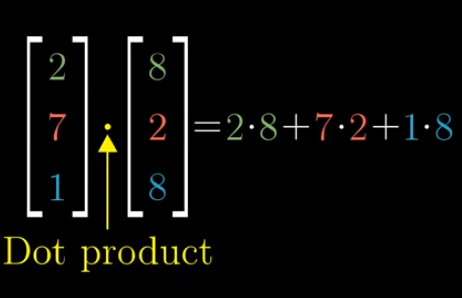
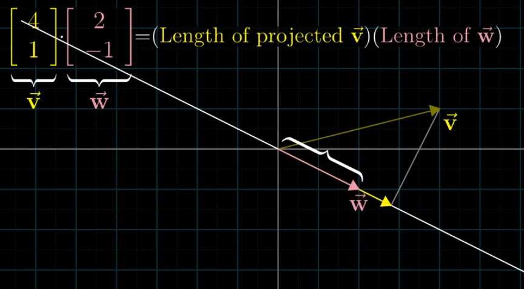

# Table of Contents
- [Dot product](#dot-product)
  - [Algebraic Representation](#algebraic-representation)
  - [Geometric Representation](#geometric-representation)
- [Linear Transformation](#linear-transformation)
- [Duality](#duality)
  - [Formula](#formula)

# Dot product

- Dot product of 2 vectors measures **how much the 2 vectors point in the same direction**
- Negative  ⇒ v.w < 0
    - If the projected vector is pointing in opposite direction from the vector
- Zero   ⇒ v.w = 0
    - If the projected vector is pointing in perpendicular direction to the vector
- Positive   ⇒ v.w > 0
    - If the projected vector is pointing in the same direction of the vector

### Algebraic Representation

- 2 vectors of same dimensions, then dot product is computed by
    - pairing up all of the co-ordinates
    - Multiplying those pairs together
    - and adding the results
    

    
> **Why this works?**  
> Dot product → measures alignment of 2 vectors (same direction)  
>  
> So, 2 vectors v and w.  
> Each component multiplication:  
> - v₁w₁ → alignment in x-direction  
> - v₂w₂ → alignment in y-direction  
> - v₃w₃ → alignment in z-direction  
>  
> Summing up these alignments → gives total alignment (dot product)

### **Geometric Representation**

- **Geometric Representation** of Dot Product between 2 vectors v and w

Projecting w onto the line that passes through the origin and the tip of v

Projecting v onto the line that passes through the origin and the tip of w

- Projection of w is used → how much of w vector lies in v vector
- This implies that dot product is asymmetric  
    - (i.e) v.w = w.v; Order doesn’t matter

# Linear Transformation

- Line of evenly spaced dots will be evenly spaced even after applying transformation → linear transformation
- If they gets unevenly spaced in output space → then that transformation is not linear

# Duality

The dual of a vector is the linear transformation that it encodes, and the dual of the linear transformation from some space to one dimension is a certain vector in that space

- The Linear transformation from some space to the number line, it is associated with a unique vector in that space → performing the linear transformation is the same as taking the dot product with that vector
- Because, numerically the transformation is described by a matrix with just one row, where each column tells the number that each basis vector lands on
- Multiplying this matrix by some vector v is computationally identical to taking the dot product between v and that dual vector

## Formula

### **Geometric Dot Product:**

$$
v · w = |v| |w| \cos\theta
$$

where  
     |v|  → magnitude (length) of vector v  
     |w| → magnitude (length) of vector v  
     cos θ → angle **between** v and w  

Using cosine here, because it measures **how much two vectors point in the same direction** 

- If θ = 0° → vectors overlap → cos θ = 1  
- If θ = 90° → vectors are perpendicular → cos θ = 0  
- If θ = 180° → opposite directions → cos θ = –1

### **Algebraic Dot Product:**

$$
v · w = v_x w_x + v_y w_y
$$

sum of contributions in the direction of v  
Multiply x components, multiply y components and then sum up

> 💡  
> **In geometric, we project one vector onto the other, reducing the multidimensional vector into a 1D shadow along the direction of the other vector**  
>  
> **In algebraic, the dimensions aren’t reduced explicitly**

