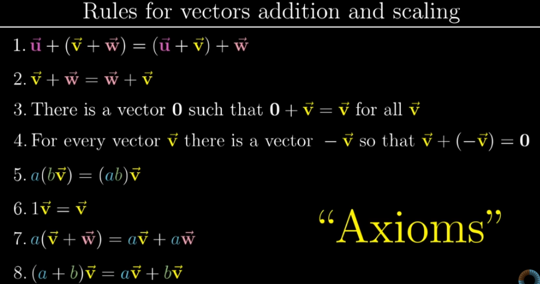

# Table of Contents
- [Functions](#functions)
- [Vector Space](#vector-space)

## Functions

- Functions are just another type of vector
- Functions can be scaled, added
- Linear transformation of a function takes a function and produces the transformed function
    - Example: In calculus, Derivative → transforms one function into another function
- Linear transformation follows 2 properties
    1. Additivity
        - Adding 2 vectors and applying transformation is same as, transforming the vectors individually and adding them
        - L(v+w) = L(v) + L(w)
    2. Scaling
        - Scaling the vector and applying transformation is same as, Applying transformation and scaling it
        - L(cv) = cL(v)
    
    > Derivative is Linear
    Additive, has scaling property
    Scaling property is also True
    > 
- Function spaces have a tendency to be infinite dimensional
- Here, we use basis functions which is similar to basis co-ordinates i hat, j hat, k hat
- **Example**
    
    
    
    d / dx is represented as a infinite matrix, with values on offset diagonal
    The polynomial is also represented as a infinite column matrix
    Infinite → because the powers of polynomials can get larger infinitely
    
- Linear algebra concepts In functions,
    - Linear transformations → Linear operators
    - Dot products → Inner products
    - Eigen vectors → Eigen functions

# Vector Space

A **vector space** is a set of vectors along with operations of **addition** and **scalar multiplication** that satisfy the following properties:

