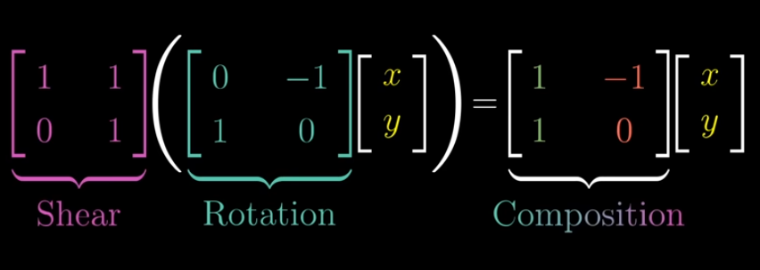

# Linear Transformation

## Table of Contents
- [Linear Transformation](#linear-transformation)
  - [Matrix](#matrix)
  - [Composition](#composition)
  - [Matrix Multiplication](#matrix-multiplication)
- [3D Linear transformation](#3d-linear-transformation)

# Linear Transformation

- **Transformation**: takes inputs and apply some function, and provides outputs
- In linear algebra, transformation takes in a vector and provides another vector
- A transformation is linear if it has 2 properties
    1. All lines must remain as lines without getting curved
    2. And origin must remain fixed in place
    
    <aside>
    💡
    
    A transformation is linear if it satisfies these 2 props:
    
    L(v+w) = L(v) + L(w)   “Additivity”
    
    L(cv) = cL(v)               “Scaling”
    
    </aside>
    
- In linear transformation, grid lines remain parallel and evenly spaced
- Can modify i hat and j hat to transform linearly
- **Example (2D transformation)**

    
    Background gray lines are original 
    Origin is fixed](attachment:6ae6fa1c-e110-4d74-ba68-94befc49a603:image.png)
    
    Background gray lines are original 
    Origin is fixed

    
    By knowing i hat and j hat, we can transform any vector](attachment:be68217e-6a88-40d7-b042-b639057cf191:image.png)
    
    By knowing i hat and j hat, we can transform any vector
    
    - The i hat and j hat co-ordinates are commonly packed into a 2*2 matrix
        
        
        
- **Shear Transformation**
    - Angles changes
    - areas stay the same Only when the shear matrix has determinant 1
    - General shear matrix is
        
        [ 1   k ]
        
        [ 0    1]
        
        Determinant =1 → no area change
        
    - ex: rectangle → parallelogram

> If transformed î and ĵ become linearly dependent
> 
> 
> → the two columns of the matrix are dependent
> 
> → determinant = 0
> 
> → transformation collapses all of 2D space into a line
> 
> → matrix becomes **non-invertible**
> 

### Matrix

- Matrices are transformation of space
- Each column of matrix tells how the space is being stretched/skewed

### Composition

- Applying a rotation and shear

- This new matrix captures the same overall changes, rotation and then shear
- New matrix here is typically a product of shear and rotation
- A·(B·v)
    
    → first B transforms v
    
    → then A transforms the result
    
- Matrix Multiplication like this, has a geometric meaning of applying one transformation then another
- **Needs to read right to left** → stems from function notation, since we write functions on the left of variables so every time we compose 2 functions, we always have to read it from right to left

### Matrix Multiplication

- **ordering does matters**
    
    M1M2 is not equal to M2M1
    
- It is associative
    
    A (BC) = (AB) C
    
    - Just read the transformation from left to right, same process

# 3D Linear transformation

- Similarly keeps the grid lines parallel and origin is fixed
- Transformations is based on basis vectors(unit vectors) **i hat** (in x direction) , **j hat** (in y direction) and **k hat** (in z direction)
- 3D Transformation can be described only by using 9 numbers (3*3 matrix)
- Each of input vector co-ordinates can be considered as of instructions that guides us how to scale each basis vector, and that adds together to get the output vector

    
    Multiply the co-ordinates by the corresponding columns of the vectors, then added together to produce resultant vecto](attachment:a58bd880-63e8-4f37-8957-e294ec583149:image.png)
    
    Multiply the co-ordinates by the corresponding columns of the vectors, then added together to produce resultant vecto
    
- Multiplying two 3*3 matrices is also similar to 2D, first applying the transformation encoded in right one, and then by left one
