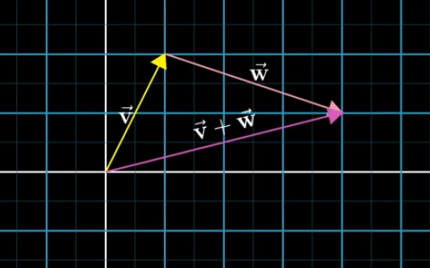
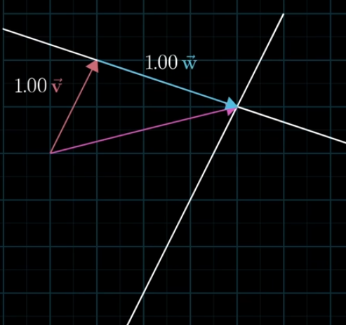

# Vectors

## Table of Contents
- [Vector](#vector)
  - [Vector Addition](#vector-addition)
  - [Scalar multiplication](#scalar-multiplication--scaling)
- [Linear combination, span and basis vectors](#linear-combination-span-and-basis-vectors)
  - [Basis vectors](#basis-vectors)
  - [Linear combination](#linear-combination)
  - [Span](#span)
  - [Linearly Dependent](#linearly-dependent)

# Vector

- In mathematical,  vector is combination of geometric representation and numerical representation
- Geometric representation → Vectors are arrows in space
- Numerical representation → list of numbers
- Useful in data analysis

### **Vector Addition**

- Vector is multiplied with another vector
- Visual way :
    - Place the starting edge of second vector to the tip of first vector
    - New vector from start of first vector to tip of second vector is the r*esultant one*
    
    
    

### **Scalar multiplication** → ***Scaling***

- Vector gets multiplied by a *scalar* (number)
- If the number is negative, then scales in opposite direction

## Linear combination, span and basis vectors

### Basis vectors

- unit vector in the x-direction, i hat - pointing to right with length 1
- Unit vector in the y-direction, y hat - pointing to top with length 1
- i hat and j hat are “Basis vectors” of the xy coordinate system
- Every 2d vector can be written in x i hat + y j hat format

> New co-ordinate system can be created by choosing different basis vectors
> 

### Linear combination

- Process of scaling the two vectors and adding them
    
    > let v and w be vectors, a and b be scalars
    Linear Combination : av + bw
    > 
- If one of the scalar is fixed and let the other one move freely, the tip of the resultant vector draws a straight line
    
    
    
    blue and pink are vectors, purple is resultant
    
- If both scalars can be moved freely, then we can reach every possible point in the plane
    - If two vectors have same direction, then tip can be passed through the single line passing through the origin
    - If both the vectors are zero → single point (origin)

### Span

- Set of all possible vectors that can be reached with a linear combination of the given pair of vectors is called the Span of those 2 vectors
- 3 Possible outcomes of span(v, w)
    1. Not multiples
        - entire infinite sheet of 2D space
    2. One is scaled version of the other (vectors line up)
        - span is just a line
    3. Both vectors are zero
        - Span is {0} → single point (0 dimensional)
- “Spanning the plane” -  means the plane must pass through the origin

> If processing with collection of vectors → think them as points
> 

### Linearly Dependent

- One vector can be represented as linear combination of another vector
- Linearly dependent vectors are redundant, doesn’t contribute to the ***Span***
- If a vector doesn’t add any dimension to the span → then it is dependent
- **If a vector is a linear combination of a set of vectors, the vectors are linearly dependent**
    - **If there exists ANY non-zero pair (a, b)** such that:
        
        ```python
        a·v + b·w = 0
        ```
        
        then they are **linearly dependent**
        
    - Check if one is a scalar multiple of other
- **Linearly Independent** : A Vector adds a new dimension to the span
    - If v and w are dependent(one is multiple of other), then

> The basis of a vector space is a set of linearly independent vectors that span the full space
>
