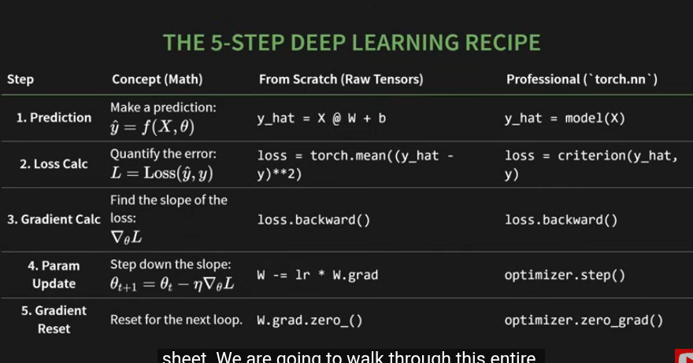

# **PyTorch**

## **Table of Contents**

* [Tensor](#tensor)

  * [Creating Tensor](#creating-tensor)
  * [Attribute of tensor](#attribute-of-tensor)
* [Autograd](#autograd)
* [Operations](#operations)

  * [Reduction Operations](#reduction-operations)
  * [Selecting the data](#selecting-the-data)
  * [Tensor → Python value](#tensor--python-value)
* [Gradient](#gradient)
* [torch.autograd](#torchautograd)

  * [AutoGrad components](#autograd-components)
  * [Computational Graphs](#computational-graphs)
* [torch.nn module](#torchnn-module)

  * [Activation Functions](#activation-functions)
  * [nn.embedding](#nnembedding)
  * [nn.layernorm](#nnlayernorm)
  * [nn.dropout](#nndropout)
* [torch.optim](#torchoptim)

  * [Optimizer](#optimizer)

---

# Tensor

- Multi-dimensional array

## Creating Tensor

1. **Direct Creation from data**
    - Python list → tensor
    - Use torch.tensor()
    
    ```python
    import torch
    
    data = [[1, 7], [3, 15]]
    tendor_data = torch.tensor(data)
    
    print(tensor_data)
    ## tensor([[1, 7],
    #					[3, 15]])
    ```
    
2. **Creation from desired shape**
    - Used when we know the shape, but not the values yet
    - used to initialize model weights
    
    ```python
    shape = (2, 3)
    
    ones = torch.ones(shape)      # 2*3 of 1s
    zeros = torch.zeros(shape)    # 2*3 of 0s
    random = torch.randn(shape)   # 2*3 of random numbers
    # range: between -inf to inf with mean=0 & sd=1 
    
    random = torch.rand(shape)    # 2*3 of random numbers
    # range: between [0, 1)
    ```
    
3. **Creation by mimicking another tensor**
    - Used when we need a new tensor with exact same shape and type as another one
    - Optionally, New data type can be specified
    
    ```python
    template = torch.tensor([[1,2], [5, 7]])
    rand_like = torch.randn_like(template, dtype=torch.float)
    ```
    

## Attribute of tensor

- **.shape**
    - A tuple describing the dimensions
    - Maximum errors in PyTorch occur due to shape mismatches
- **.device**
    - Tells where the tensor lives either on CPU or GPU
- **.dtype**
    - The data types of the numbers
    - Default is float32 (the model parameters are in float type)

# Autograd

- Its’s a system called **Automatic differentiation.** PyTorch’s automatic built-in calculator
- To activate the system, we need set ***requires_grad = True*** so that i consider the tensor as a learnable parameter or else just as a data
- *requires_grad = True* sends a message to the autograd engine to track every single operation happens to the model parameters
    
    ```python
    **# data tensor**
    x = torch.tensor([[1,2], [5, 7]])
    print(x.requires_grad)   # False
    
    **# parameter tensor** 
    weight = torch.tensor([[1.0], [1.0]], requires_grad = True)
    print(x.requires_grad)   # True
    ```
    
    ```python
    **# data tensor**
    x = torch.tensor([[1,2], [5, 7]])
    print(x.requires_grad)   # False
    
    **# parameter tensor** 
    weight = torch.tensor([[1.0], [1.0]], requires_grad = True)
    print(x.requires_grad)   # True
    ```
    
- When requires_grad is True, pytorch starts to build a computation graph
    - Computation graph → similar to live recording of the operations
    
    ```python
    	***# Assume y = x*w and x, w are learnable parameters of the model*
    	
    	y = x*w
    	*# pytorch creates a computation graph here**
    	## x and weight are connected together by multiply operation
    	## this produces the resultant tensor y
    	
    	**# To Verify*
    	print(y.grad_fn)  # <mulbackward0 object="">**
    	**print(x.grad_fn)  # None**
    ```
    
    - Every tensor created by an operation has a special attribute  → **grad_fn**
- PyTorch uses this computation graph to calculate the gradient

# Operations

*** Operator**

- Element-wise multiplication; Multiplies matching positions
- Tensors must have the same exact shape
    
    ```python
    a = torch.tensor([[10, 20], [30, 40]])
    b = torch.tensor([[1, 2], [3 , 4]])
    
    print(a*b)
    print(a.mul(b))
    c = torch.rand_like(a)
    torch.mul(a, b, out = c) # c stores the result
    
    ##  tensor([[10, 40],
    #					 [90, 160]])      
    # [[1*10, 2*20], [3*30, 4*40]]
    ```
    

**@ Operator**

- Matrix multiplication
- Number of columns in 1st matrix = number of rows in the second matrix must be true
    
    ```python
    m1 = torch.tensor([[1, 2], [3 , 4]])   # 2*2 matrix
    m2 = torch.tensor([[2], [3]])          # 2*1 matrix
    
    print(m1 @ m2)
    print(m1.matmul(m2))
    m3 = torch.rand_like(m1)
    torch.matmul(m1, m2, out = m3) # m3 stores the result
    ##  tensor([[8, 18]])      
    ```
    

### Reduction Operations

- Reduction is any operation that reduces a tensor to a smaller number of elements
    - Example: sum, mean, max
- Default Behavior → Collapse the entire tensor
    
    ```python
    a = torch.tensor([[1, 2], [3 , 4]])
    print(a.mean())  # 2.5  
    
    # (1 + 2 + 3 + 4) /4
    ```
    
- **dim argument →** allows to control which direction to ****collapse
    - For example, consider a 2D tensors
        - dim = 0 → collapses rows; Operates vertically
        - dim = 1 → collapses columns; Operates horizontally
        
        ```python
        a = torch.tensor([[1, 2], [3 , 4]])
        print(a.mean(dim=0))  # tensor([2.0, 3.0])
        # (1 + 3)/2 , (2 + 4)/2
        
        print(a.mean(dim=1))  # tensor([1.5, 3.5])
        # (1 + 2)/2 , (3 + 4)/2
        ```
        

### Selecting the data

- Standard indexing works just like NumPy. It’s for selecting uniform “blocks” of data
    - Example
    
    ```python
    print(a[:, 2])     ## prints all rows of column 2
    ```
    
- **Dynamic Selection**
    
     **Argmax →** Finds the index of the highest value
    
    ```python
    a = torch.tensor([[1, 2], [3 , 4]])
    print(a.argmax(dim=1))  # tensor([1, 1]) 
    ```
    
    **torch.gather() →** Custom selection from each rows; Done this in one, and highly optimized operation
    
    ```python
    data = torch.tensor([[1, 2, 3], 
    										[4, 5, 6]])
    
    indices_to_select = torch.tensor([[0], [2]])
    
    selected = torch.gather(data, dim=1, index=indices_to_select)
    
    **## tensor([[1], [6]])**
    ```
    

### Tensor → Python value

If we have a single-element tensor, for example by aggregating all values of a tensor into one value, it can be converted into a Python numerical value using ***item()***

```python
aggregated_value = tensor.sum()
aggregated_item = aggregated_value.item()

print(type(aggregated_item))
# <class 'float'>
```

> To make in-place changes, _ is used
For example: x.copy_(y), x.t_(), will change x

Tensors on the CPU and NumPy arrays can hare their underlying memory locations, changing one will change the other 
numpy() → tensor to numpy
from_numpy() → numpy to tensor


# Gradient


Step 1: Forward pass

- Implements the model
- Data and initialize weights
- Predict the outputs

Step 2: Backward pass

- Post-Mortem analysis
- Travel backward from “loss” and calculate gradients for all parameters with ‘requires_gard=True’
    
    ```python
    **loss.backward()**
    ```
    
    - It populates a hidden attribute of the model parameters → **.grad** attribute

**torch.no_grad() →** Says to not include these parameter updates

**.grad.zero_()**  resets the gradients after each iteration

> Can set the value of requires_grad when creating a tensor or later by using x.requires_grad_(True) method


# Autograd
# torch.autograd

- Provides classes and functions implementing **automatic differentiation of arbitrary scalar valued function**
- As of now, autograd is supported only fro floating point Tensor types (half, float, double and bfloat16) and complex Tensor types(cfloat, cdouble)
- ***backward***
    - Compute the sum of gradients of given tensors with respect to graph leaves
- ***grad***
    - Compute and return the sum of gradients of outputs with respect to the inputs
- Can only obtain the *grad* properties for the leaf nodes of the computational graph, which have ***requires_grad*** property set to True

## AutoGrad components

1. tools/autograd 
    - Definition of the derivatives (derivatives.yaml), several python scripts and a folder called templates
    - These scripts and the templates are used at building time to generate the C++ code for the derivatives
2. torch/autograd
    - Autograd components that can be used directly from python are located here. For ex, Jacobian product, hessian, and other gradient related computations of a gn function
    - In function.py, it has torch.autograd.Function class (which is used by users to write there own differentiable functions)
3. torch/csrc/autograd 
    - The computational graph creation and execution-related code present here
    - All the code is written in C++

## Computational Graphs

- Autograd keeps a record of data (tensors) and all executed operations (along with the resulting new tensors) in a directed acyclic graph (DAG)
- In this DAG, leaves are the input tensors, roots are the output tensors
- Gradient calculation →Tracing the graph from roots to leaves using the chain rule
- In a forward pass, autograd does two things
    - run the requested operation to compute a resulting tensor
    - maintain the operation’s gradient function in the DAG
- In the backward pass, .backward() is called on the DAG root.
    - Computes the gradients from each .grad_fn
    - Accumulates them in respective tensor’s .grad attribute
    - Using the chain rule, propagates all the way to leaf tensors

> DAG’s are dynamic in PyTorch 
The graph is recreated from the scratch after each .backward() call, autograd starts populating a new graph
So, we can change the shape, size and operations at every iteration if needed
> 

***AutogradMeta*** Object ***→***  is used to hold the graph information

***grad_fn →*** A pointer to the function that created a resultant tensor, and will be used to compute the gradient of that operation

# torch.nn module

- Packs the model parameters as a professional object
- Parameter
    - A special tensor that has requires_grad = True by default
    - Auto-registers with the model
    - Handles all the bookkeeping
- Example, linear() in .nn module has weight and bias as parameters

## Activation Functions

- Introduces non-linearity, enabling the model to learn and represent complex data patterns
- Decide whether a neuron should be activated based on the weighted sum of inputs and a bias term

```python
sample_data = torch.tensor([-2.0, -0.5, 0, 0.5, 2.0])
```

### nn.ReLU

- Rectified Linear Unit
    
    $$
    ReLU(x) = max(0, x)
    $$
    
    ```python
    relu = torch.nn.ReLU()
    print(relu(sample_data))   **# tensor([0.0000, 0.0000, 0.0000, 0.5000, 2.0000])**
    ```
    

### nn.GELU

- Gaussian Error Linear Unit
- A modern standard for Transformers (ex, GPT, Llama)
- A smoother, gently curving version of ReLU
    
    ```python
    gelu = torch.nn.GELU()
    print(gelu(sample_data))   **# tensor([-0.0455, -0.1543,  0.0000,  0.3457,  1.9545])**
    ```
    
- GELU multiplies the input by its probability under a Gaussian distribution, allowing for a smoother transition around zero

### nn.softmax

- Used on final output layer for classification
- Converts the raw model scores(logits) into probability distribution
- Output values always lies between 0 and 1 and the sum of probabilities will be 1
    
    ```python
    softmax = torch.nn(Softmax(dim = -1)
    
    **## Raw model Scores for 2 items across 4 possible classes**
    logits = torch.tensor([[1.0, 3.0, 0.5, 1.5], [-1.0, 2.0, 1.0, 0.0]])
    print(softmax(logits))
    
    **## tensor([[0.0939, 0.6942, 0.0570, 0.1549],
    ##        [0.0321, 0.6439, 0.2369, 0.0871]])**
    ```
    

## nn.embedding

- It turns the words into numbers. Each word gets a own unique vector
- It is a learnable lookup table, stores embeddings of a fixed dictionary and size
- Used to store word embeddings and retrieve them using indices
- Input → list of indices and output → Corresponding word embeddings

```python
**torch.nn.Embedding(*num_embeddings*, *embedding_dim*, *padding_idx=None*, *max_norm=None*, *norm_type=2.0*, *scale_grad_by_freq=False*, *sparse=False*, *_weight=None*, *_freeze=False*, *device=None*, *dtype=None*)**
```

*num_embeddings* → size of the dictionary

*embedding_dim* →size of each embedding vector

*max_norm* → if given, each vector with norm larger than max_norm is normalized to have norm max_norm

```python
**## embedding**

num_embeddings = 5
embedding_dim = 3

embedding_layer = torch.nn.Embedding(num_embeddings, embedding_dim)

input_ids = torch.tensor([1, 0, 4])
word_vectors = embedding_layer(input_ids)
print(word_vectors.shape, word_vectors)

**## torch.Size([3, 3]) tensor([[ 0.4940,  0.1305, -0.3337],
##        [ 0.2778, -0.8024, -1.2351],
##        [-0.5064, -1.5459,  0.9382]], grad_fn=<EmbeddingBackward0>)**
```

## nn.layernorm

- Prevents values from exploding/vanishing by rescaling to stable range
- Applies layer normalization over a mini-batch of inputs
- Mean = 0, sd = 1

```python
**## layer norm**

batch, sentence_length, embedding_dim = 3, 5, 2
embedding = torch.randn(batch, sentence_length, embedding_dim)
layer_norm = torch.nn.LayerNorm(embedding_dim)

layer_norm(embedding)

# tensor([[[ 0.9996, -0.9996],
#          [ 0.9999, -0.9999],
#          [ 0.9998, -0.9998],
#          [-1.0000,  1.0000],
#          [ 1.0000, -1.0000]],

#         [[-0.1229,  0.1229],
#          [ 1.0000, -1.0000],
#          [ 0.9999, -0.9999],
#          [ 1.0000, -1.0000],
#          [ 1.0000, -1.0000]],

#         [[ 1.0000, -1.0000],
#          [-1.0000,  1.0000],
#          [ 1.0000, -1.0000],
#          [ 0.9997, -0.9997],
#          [-1.0000,  1.0000]]], grad_fn=<NativeLayerNormBackward0>)
```

## nn.dropout

- Prevents over-fitting by randomly zeros neurons during training
- Activate dropout for training → torch.nn.Dropout(p = 0.5).**train()**
- To deactivate dropout → dropout_layer.**eval()**

<aside>
💡

**nn.module → organize the model**

**torch.optim → Automate the learning**

</aside>

# t**orch.optim**

- **Used to Automate the learning**
- A package implementing various optimization algorithms
- To use an optimizer, we have to construct an optimizer object that will hold the current state and will update the parameters based on the computed gradients
- To construct an optimizer, we need to give an iterable containing the parameters or named parameters to optimize, and can specify optimizer-specific options such as learning rate, weight decay, etc
    
    

## Optimizer

- Optimization is the process of adjusting model parameters to reduce model error in each training step

### Inside the training loop, optimization happens in 3 steps

- ***optimizer.zero_grad() →*** To reset the gradients of model parameters. Gradients by default add up, to prevent double counting → reset them to zero at each iteration
- ***loss.backward()*** →Backpropagate the prediction loss; PyTorch deposits the gradient of the loss w.r.t each parameter
- ***optimizer.step() →***To adjust the parameters by the gradients collected in the backward passs

<aside>
💡

***→ A model is just an nn.Module containing layers***

***→ A Layer is just a container for parameters that performs a mathematical operation***

***→ Learning is just upgrading parameters with zero_grad, backward, step***

</aside>
