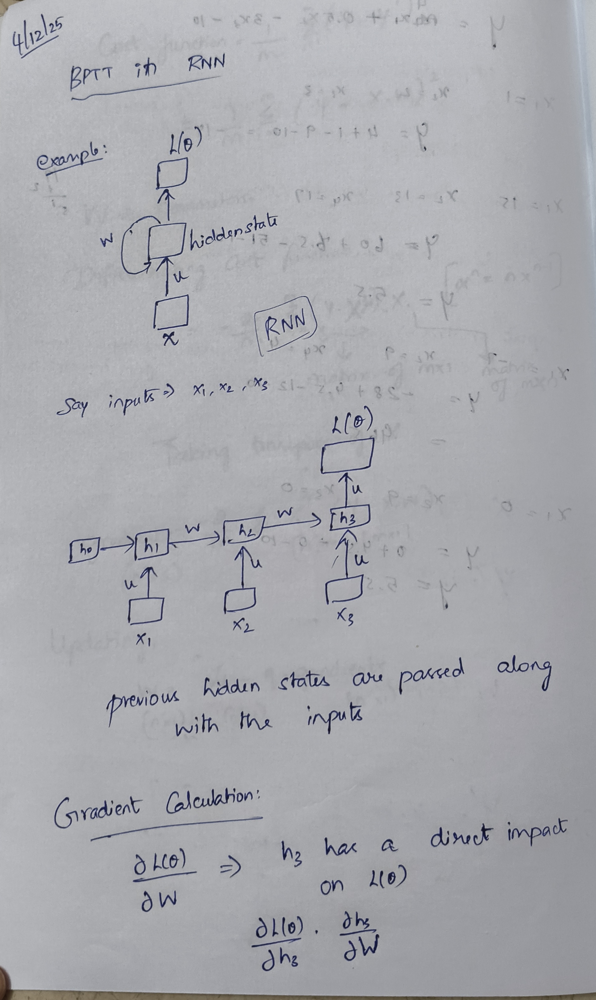
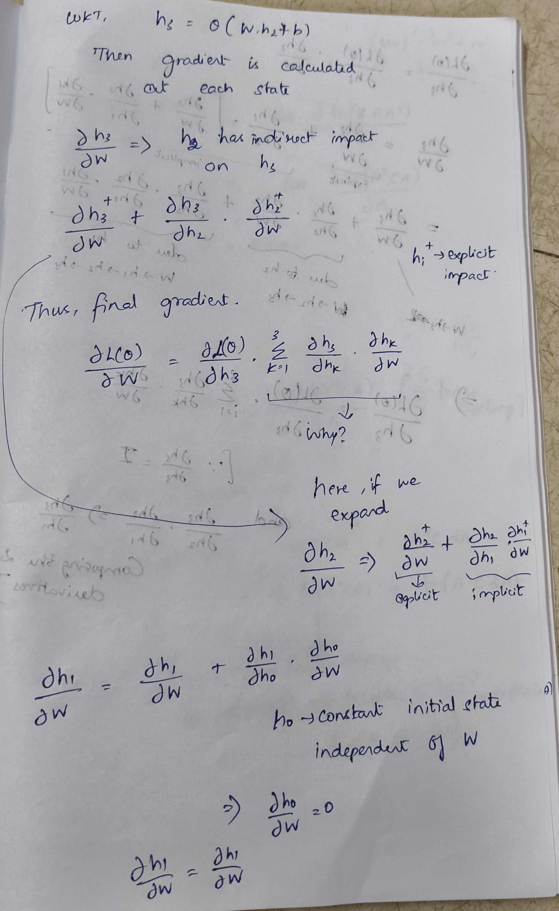
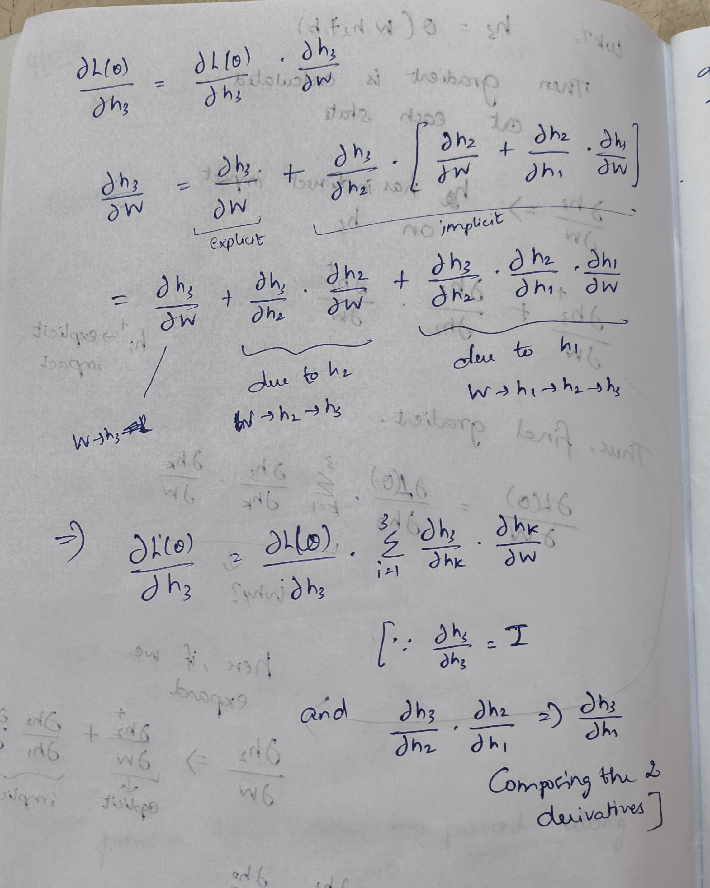

# Recurrent Neural Network

## **Table of Contents**

* [Recurrent Neural Network](#recurrent-neural-network)

  * [Components](#components)

    * [Recurrent Neurons / Units](#recurrent-neurons--units)
    * [RNN Unfolding](#rnn-unfolding)
  * [Architecture](#architecture)
  * [Types of RNN](#types-of-rnn)

    * [One to One RNN](#one-to-one-rnn)
    * [One to Many RNN](#one-to-many-rnn)
    * [Many to One RNN](#many-to-one-rnn)
    * [Many to Many RNN](#many-to-many-rnn)
  * [Back Propagation Through Time (BPTT)](#back-propagation-through-time-bptt)

---

# **Recurrent Neural Network**

- RNNs feed information back into the network at each step
- Works by remembering the past information and passing the output from one step as input to the next

## **Components**

###1. **Recurrent neurons / units**
    - A neuron that loops back to itself
    - Recurrent Unit hold a hidden state that maintains the information about previous inputs in a sequence
    - That hidden state is passed to the next time step. So the neuron “remembers” because it always receives its own previous output
    - Allowing them to capture dependencies across time
    - At each time step *t*, the RNN has:
        - *Input*: the word at position *t*
        - *Hidden state (memory):* *hₜ*
        - *Previous hidden state*: *hₜ₋₁*
            
            $$
            hₜ = f(W_x · xₜ  +  W_h · hₜ₋₁)
            $$
            
            Combines the previous memory to form the new memory
            
###2. **RNN unfolding**
    - Process of expanding the RNN across time so we can see every step and the hidden states, enabling back Propagation through time (BPTT)
    - BPTT → learning process where error are propagated across time steps to adjust the network’s weights
        - For example, consider a 3 page chapter. Page 3 confusion → realized page 2 is misunderstood → realized page 1 is misunderstand

## Architecture

- Similar to ANN, but differ in how information flows from input to output
- Uses shared weights across time steps, allowing them to remember information over sequences
1. **Hidden State Calculation**
    
    $$
    hₜ = f(W_x · xₜ  +  W_h · hₜ₋₁ + B)
    $$
    
2. **Output Calculation**
    
    $$
    Y = O(V.h + C)
    $$
    
    O → activation function to the weighted hidden state 
    

## Types of RNN

1. **One to One RNN**
    - Single input and single output
    - Used for straightforward classification tasks, where no sequential data is involved
2. **One to Many RNN**
    - Single input and multiple outputs over time
    - Example: Image captioning (single image → generate a sequence of words as a caption)
3. **Many to One RNN**
    - Sequence of inputs → single output
    - Example: Sentiment analysis (entire context of the sentence is needed to make one single output like positive, negative or neutral)
4. **Many to Many RNN**
    - Sequence of inputs → Sequence of outputs
    - Ecample: language translation

## Back Propagation through Time (BPTT) in RNN

