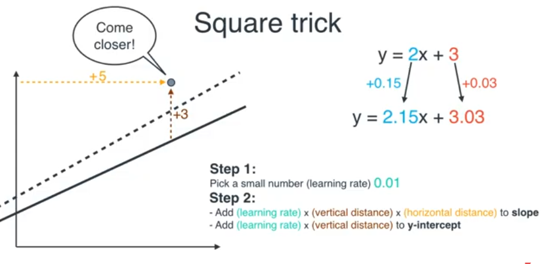

# Linear Regression

- Finding the bast fit line for a set of points and using that line to make a prediction

### **Line equation**

- For single feature,

$$
y = mx + c
$$

where m is slope and c is y-intercept

- For multiple features,

$$
y = w_1x_1 + w_2x_2 + .... + w_n x_n + b
$$

where x1,..xn are features, w1,..wn are weights and b is bias

### **General equation**

$$
\text h(x) = \sum_{i=0}^n \theta_i x_i  \\[5mm]
\text where, x_0 = 1
$$

Here x0 = 1 (intercept), theta → parameters

- Linear regression has no local minimum → the loss function is quadratic resulting in quadratic curve

$$
\text{cost function} = \frac{1}{2} \sum_{i=1}^{m} (\hat{y}_i - y_i)^2 \\[5mm]
\text{(i.e)}\ \frac{1}{2} (X\theta - Y)^T (X\theta - Y) \\[3mm]
\text{As, } A^T \cdot A = A^2
$$

- Instead of using gradient descent in linear regression, we can find directly by equating the derivative to 0 vector. Loss will be minimum when it is 0

$$
\theta = (X^T X)^{-1} X^T y
$$

  
### Transformation

- **Rotation → changing slopes**
    - counter-clockwise rotation - Increase slope
    - clockwise rotation - Decrease slope
- **Translation → changing the y-intercept**
    - Translate line up - Increase y-intercept
    - Translate line down - Decrease y-intercept
- Need to take tiny step at a time → Use appropriate learning rate (small positive constant)
- Line get moved by rotation and translation

### **Process**

- Start with a random line
- Define the number of iterations/repetitions or epochs and a learning rate
- Repeat until max_iterations
    
    Pick a random point 
    
    1. If point is above line and to the right of the y-axis
        - Add learning rate to slope
        - Add learning rate to y-intercept
    2. If point is above line and to the left of the y-axis
        - Subtract learning rate to slope
        - Add learning rate to y-intercept
    3. If point is below line and to the right of the y-axis
        - Subtract learning rate to slope
        - Subtract learning rate to y-intercept
    4. If point is below line and to the left of the y-axis
        - Add learning rate to slope
        - Subtract learning rate to y-intercept

### **Modified Process**

- To rotate, Add (vertical distance)*(horizontal distance) to slope
- To translate, Add (vertical distance) to y-intercept
    
    
    

### Square Error

- Compute the distance between the line and the points (error) and square them
- Move the line in such a way that the error gets reduced → line closer to the points
    - Using gradient descent
- Squared error is preferred → Smooth, differentiable, works well with gradient descent

### Absolute Error

- Sum of distance between the line and the points
