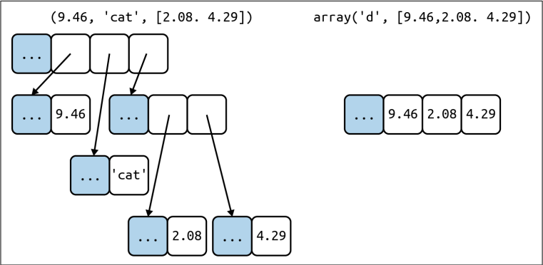

# Fluent Python - Chapter 2: Array of Sequences

## Table of Contents

1. [Types](#types)

   1. [Container Sequences](#container-sequences)
   2. [Flat Sequences](#flat-sequences)
2. [Based on Mutability](#based-on-mutability)

   1. [Mutable Sequence](#mutable-sequence)
   2. [Immutable Sequence](#immutable-sequence)
3. [Slicing](#slicing)
4. [List Comprehension](#list-comprehension)
5. [Generator Expressions](#generator-expressions)
6. [Using + and \* with Sequences](#using--and--with-sequences)
7. [Augmented Assignment with Sequences](#augmented-assignment-with-sequences)
8. [Sorting List](#sorting-list)
9. [Tuple](#tuple)
10. [Pattern Matching (Python ≥ 3.10, PEP 634)](#pattern-matching-python-≥-310-pep-634)
11. [Arrays](#arrays)
12. [Memory Views](#memory-views)

## Types

### Container Sequences

* Can hold items of different types, including nested containers
* Example: *list, tuple* and *collections,deque*
* **Holds references to the objects it contains**

### Flat Sequences

* Hold items of one simple type
* Example: *str, bytes, array.array*
* **Stores the value of its content in its own memory space**

**Example**



tuple - Left side; Array - Right side

* tuple: has an array of references to its items; Each item is a separate Python object
* array: A single object, holding array values

> Every python object in memory has a header with metadata.
> Holding the raw values (array) is much more compact than using tuple of objects

## Based on mutability

### Mutable sequence

* can be modified; example: list, array.array, bytearray

### Immutable sequence

* Cannot be modified; example: set, str, tuple

## Slicing

* **Slicing and range exclude the last item**

  * As it is easy to find the length,

    * when only stop position is given, then length is stop value
    * when start and stop are given, then length is stop-start
  * Easy to split the sequence in two parts at any index x. without overlapping
* to evaluate the expression seq\[start\:stop\:step], Python calls seq.**getitem**(slice(start, stop, step))
* Multidimensional slicing:

  * Example: 2 dimensional slice is obtained with an expression like *seq\[m\:n, k\:l]*
* **Use case:**

  1. Extract information from sequences
  2. Used to change mutable sequences

  ```python
  l = list(range(10))
  print(l)   **# [0, 1, 2, 3, 4, 5, 6, 7, 8, 9]**

  l[2:5] = [14]
  print(l)   **# [0, 1, 14, 5, 6, 7, 8, 9]**
  ```

## List Comprehension

* List comprehension - used to built a new list
* It build lists from sequences or any other iterable type by filtering and transforming items

### Local Scope:

* In normal listcomp, the loop variable will get disappears

  ```python
  x = 'ABC'
  codes = [ord(c) for c in x]
  print(c)    **# NameError: name 'c' is not defined**
  ```

* Using *walrus* operator, it has the enclosing scope(like main func or global scope), the loop variable retains

  ```python
  x = 'ABC'
  codes = [last := ord(c) for c in x]
  print(last)    **# prints 67 -> ord(C)**
  ```

## Generator Expressions

* To initialize tuples, arrays, and other types of sequence, genexp is used
* Saves memory because it yields the results one by one

## Using + and \* with Sequences

* Both + and \* always create a new object, and never change their operands

```python
l = [1, 2, 3]
print(l * 2)   # [1, 2, 3, 1, 2, 3]

print(l)       # [1, 2, 3]
**# l remains unmodified**
```

* \*\*\* creates shallow copies\*\* of the outer list
* For mutable elements (list, dict, set), shared references, which can lead to subtle bugs.

```python
l2 = [1, 2, 3, [4, 5]]
l3 = l2 * 2

print(l3)   **# [1, 2, 3, [4, 5], 1, 2, 3, [4, 5]]**

l3[3].append(6)
print(l3)   **# [1, 2, 3, [4, 5, 6], 1, 2, 3, [4, 5, 6]]**

l3[3] = [12]  **# replaces the reference, safe**
```

* If nested list is used, instead of using \*, we can use listcomp

  ```python
  board1 = [['_'] * 3] * 3    **# wrong, references to the same inner list**
  board1[0][1] = 1 **# changes every value at [1] column regardless of the row**

  board2 = [['_'] * 3 for i in range(3)]
  ```

## Augmented Assignment with Sequences

* Augmented assignment operators:

  * += → in-place addition → **iadd** is called
  * \*= → in-place multiplication → **imul** is called
* Mutable sequences are changed in-place, if **iadd** is not defined then it performs **add**

  * a+=b happens inplace if **iadd** is present
  * Else a = a+b happens, a+b is done and it returns a new object which is assigned to ‘a’
* In immutable sequence, new object is created

```python
t = (1, 2, [30, 40])
t[2] += [50, 60]

**# this will changes the t[2] into [30, 40, 50, 60]
# but raises a typeError with the message 'tuple' object does not support item assignment**
```

## Sorting List

1. Using list.sort()

   * sorts a list in place, without making a copy → returns None
2. Using sorted(list)

   * creates a new sorted list and returns it

### Optional key-word only arguments:

* **reverse**

  * By default, False. If mentioned True, the items are returned in descending order
* **key**

  * A one-argument function that will be applied to each item to produce its sorting key
  * Default is identity function (items themselves are compared)

```python
fruits = ["grape", "raspberry", "apple", "banana"]

print(sorted(fruits, reverse=True, key=len))
print(fruits)  **# no change**
# ["grape", "raspberry", "apple", "banana"]

fruits.sort(reverse=True)
print(fruits)  **# in-place sorting**
# ['raspberry', 'grape', 'banana', 'apple']
```

> Functions or methods that change an object in place should return None to make it clear to the caller that the receiver was changed, and no new object was created

Python sort strings lexicographically by character code, resulting in uppercase letters plcaed before lowercase letters

>

**When list is not preferred:**

1. When we need to handle millions of floating-point values, arrays saves a lot of memory → based on data size and data type, different data structures can be used
2. If we have operations like adding and removing items from opposite ends of a list, deque (double ended queue) is preferred → based on functionality, choose optimal one

## Tuple

* Immutable list
* Defined by commas, not parenthesis; parenthesis is used for grouping, not tuple-creation

  ```python
  ```

t1 = (1, 2, 3)   **# a tuple of 3 items**
t2 = 1, 2, 3     **# also a tuple of 3 items**
t = (4)
print(type(t))   **# int, not tuple**

````
    
    - For single-element tuples, we must use a **trailing comma**
- Tuples can used to hold records; each item holds the data for one field and the position of the item gives its meaning
    - While using tuple as a record, the number of items is usually fixed and their order is always important
    - Example
        
        ```python
city, year, pop, chg, area = ('Tokyo', 2003, 32_450, 0.66, 8014)
traveler_ids = [('USA', '31195855'), ('BRA', 'CE342567'), ('ESP', 'XDA205856')]
````

* References in a tuple cannot be deleted or replaces, But if the reference points to an mutable object, and that object is changed, then the value of the tuple changes

  ```python
  ```

a = (10, 'alpha', \[1, 2])
b = (10, 'alpha', \[1, 2])
print(a == b)
**# prints True**

b\[-1].append(99)
print(a == b)
**# prints False**

print(b)
**# prints (10, 'alpha', \[1, 2, 99])**

````

- If we need to check if a tuple has a fixed value, then built-in ***hash*** can be created
- An object is only hashable if its value cannot ever change. An unhashable tuple cannot be inserted as a dict key, or a set element.

## Pattern Matching (Python ≥ 3.10, PEP 634)

- *match/case* allows destructuring sequences (advanced unpacking).
- Example:
    
    ```python
match message:
    case ['BEEPER', freq, times]:
        self.beep(times, freq)
    case ['LED', ident, intensity]:
		  self.leds[ident].set_brightness(ident, intensity)
    case ['LED', ident, red, green, blue]:
        self.leds[ident].set_color(red, green, blue)
    case _:
        raise InvalidCommand(message)
````

### Key rules:

* Sequence pattern matches if:

  1. Subject is a sequence.
  2. Same number of items.
  3. Items match (with nesting).

* \[] and () behave the same in patterns.

* *str, bytes, bytearray* are treated as atomic (not sequences).

  * They can be converted into sequence and then can be used in *match clause*

* \_ matches anything but is never bound (can appear multiple times).

* Can use as to bind part of a match:

  ```python
  case [name, _, _, (lat, lon) as coord]:
  ```

* Type checks inside patterns:

  ```python
  case [str(name), _, _, (float(lat), float(lon))]:
  ```

## Arrays

* Supports all mutable sequence operations as well as additional methods for fast loading and saving such as *.frombytes* and *.tofile*
* When creating an array, you provide a **typecode**, a letter to determine the underlying C type used to store each item in the array
* the items are stored only as **numbers**:

  * **Integers** (of various sizes → 1 byte, 2 bytes, 4 bytes, 8 bytes; signed or unsigned)
  * **Floating-point numbers** (single precision float or double precision double)
* Array type doesn’t have list.sort(); To sort an array, built-in sorted function can be used
* To keep a sorted array sorted while adding items to it, use the bisect.insort function.

## Memory Views

* In Python, ***memoryview*** is a built-in class that allows to access and manipulate the *internal memory buffe*r of certain objects (like bytes, bytearray, array.array, NumPy arrays, etc.) without copying the actual data.
* It’s part of Python’s **buffer protocol** → a system that lets different objects share memory efficiently

### With memoryview (no copy, shared memory)

```python
data = bytearray(b"hello world")

# Slice creates a NEW copy
slice_data = data[0:5]
slice_data[0] = 72   **# Change copy, not original**

print(data)         # b'hello world'
print(slice_data)   # bytearray(b'Hello')

**# Using MemoryView**

# Create memoryview
mv = memoryview(data)

# Slice the memoryview (no copy)
part = mv[0:5]

# Modify original via the view
part[0] = 72   # ASCII 72 = 'H'

print(data)  **# bytearray(b'Hello world')  original changed
# Here, both part and data share the same memory, so changes in one reflect in the other.**
```

* A memoryview is essentially a generalized *NumPy* array structure. It allows you to share memory between data-structures without first copying. This is very important for large data sets.

### memoryview\.cast()

* By default, a memoryview sees the underlying buffer in its **original format** (like bytes).
* .cast(new\_format) lets to **reinterpret the same raw bytes as a different type — without copying or rearranging the bits.**
* The returned object is another memoryview, but with a different "lens" (format code).
* Both memoryviews *share the same memory* → change in one is visible in the other.
